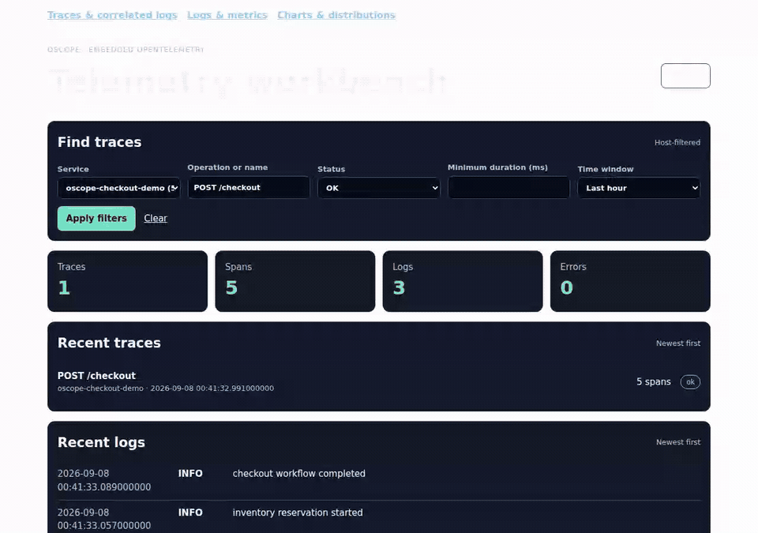

# Browser demo storyboard

These stories send a fixed-ID, fixed-shape checkout OTLP fixture through the
real receiver into an in-memory chDB collector. The same actions serve as
Playwright assertions and as reproducible product captures. Only the base
timestamp follows wall clock so telemetry remains inside the selected window.

| Scene | Playwright evidence |
| --- | --- |
| **Find the checkout.** Filter to `oscope-checkout-demo`, `POST /checkout`, and OK status, then open the trace. | The dialog must contain exactly five spans, `cart.validated`, `job.enqueued`, and the correlated `checkout workflow completed` log. |
| **Follow the queue signal.** Select gauge metrics and find `demo.checkout.queue.depth`. | The bounded raw-event table must contain the four emitted points for that metric. |
| **Turn telemetry into a chart.** Query metric-name distributions and carry the selection into the editor. | The aggregate view must contain a visible SVG plus `demo.checkout.queue.depth`; the editor must start with `:mark :bar`. |
| **Build a percentile series.** Select the exact gauge metric, five-minute buckets, service dimension, average, and p95. | The real chDB query must chart the canonical primary aggregate, retain every named aggregate column for the editor, and avoid placing returned points in Plotje source. |
| **Change the visual grammar.** Load the layered example, then edit `:mark :area` to `:mark :line`. | The UI load must create an SVG polygon; the source edit must replace it with a polyline while retaining the `Latency band` title. |



The five stills capture the [trace detail](01-checkout-trace.png),
[filtered queue metric](02-queue-depth-metric.png),
[metric distribution](03-metric-distribution.png),
[metric average/p95 series](04-metric-series.png), and
[Plotje source edit](04-plotje-line-edit.png).

## Full-page workbench: desktop and mobile

These local captures show the trace-detail attribute layout at **1440px** and
**390px**. The full-page workbench uses its own dark page theme: long attribute
labels and values stay visible, with columns on desktop and stacked rows on
mobile. Open either image for the full-resolution capture.

[](workbench-attributes-1440.png)

[](workbench-attributes-390.png)

These screenshots use a synthetic local trace, not production or Samizdat
telemetry. The browser test checks readable heading/navigation contrast,
complete text and no horizontal scrolling at these two widths; this is not a
complete accessibility audit.

Captured with Oscope `2d1f2df`, Playwright 1.61.1 and chDB 26.7.3.

Run the regression tests and regenerate captures with:

```sh
npm ci
npx playwright install chromium

env JOLT_WRAPPER=/home/chuck/ai-src/tools/jolt-with-chez-10.4.1 \
    JOLT_CHDB_LIB=/path/to/libchdb.so \
    npm run test:browser

env JOLT_WRAPPER=/home/chuck/ai-src/tools/jolt-with-chez-10.4.1 \
    JOLT_CHDB_LIB=/path/to/libchdb.so \
    npm run demo:screenshots

env JOLT_WRAPPER=/home/chuck/ai-src/tools/jolt-with-chez-10.4.1 \
    JOLT_CHDB_LIB=/path/to/libchdb.so \
    npm run demo:gif
```

Playwright starts oscope with `chdb::memory:` and does not print environment
values. Keep cloud credentials and production database specifications out of
these commands; this suite does not need either.
