# oscope server, web UI and TUI

`oscope` is one binary. It owns an embedded chDB store, accepts OTLP/HTTP JSON on
`/v1/traces` and `/v1/logs`, and serves a HyperDX-style web UI plus the JSON API it runs
on. `oscope-tui` is a terminal client of the same API.

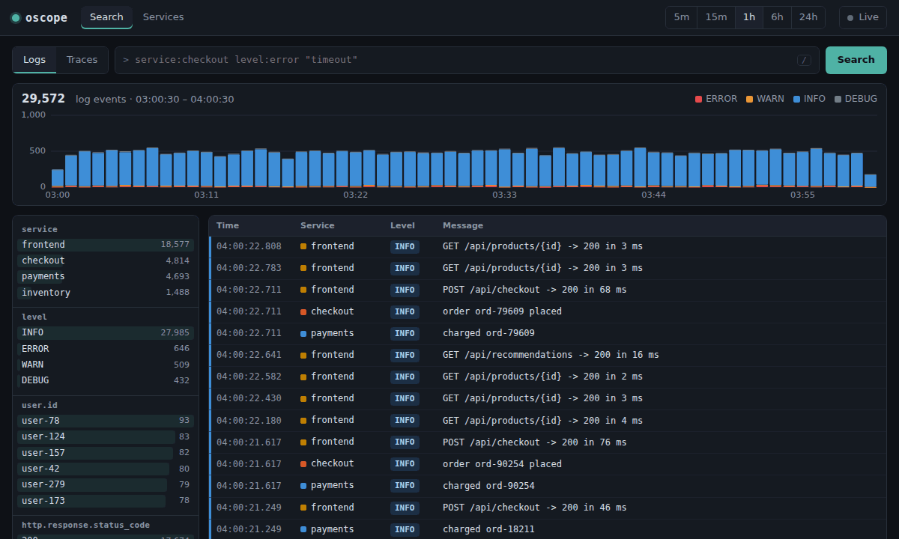

```sh
# build (needs libchdb 26.7.3; see ../README.md)
CHDB_DIR=/path/to/libchdb cargo build --release -p oscope-server

# an hour of synthetic 4-service traffic, then 5 new requests every second
target/release/oscope --db ./oscope-data --listen 127.0.0.1:8080 --seed-minutes 60 --seed-rpm 300 --live-rps 5

# or point real apps at it: OTEL_EXPORTER_OTLP_ENDPOINT=http://127.0.0.1:8080 with the http/json protocol
target/release/oscope-tui --url http://127.0.0.1:8080
```

## What's there

| | Web UI | TUI |
|---|---|---|
| Search logs and spans with the query language below | ✓ | ✓ |
| Event volume over time, with errors separated | stacked histogram, click to zoom | sparkline |
| Facets: service, level/status/kind/name, and the top attributes, with counts | click to filter, shift-click to exclude | — |
| Event detail: message, fields, attributes, resource | drawer; `+`/`−` on attributes adds filters | Enter |
| Trace waterfall across services, with error markers and the trace's logs | ✓, logs drawn as ticks on their spans | ✓ |
| Services: requests, req/min, error rate, p50/p95/p99, rate and p95 sparklines, top endpoints | ✓ | ✓ |
| Time ranges from 5m to 24h, live refresh every 3 s | ✓ | ✓ (`1`–`5`, `L`) |
| Deep links: all state is in the URL hash | ✓ | — |

### Query language

Terms are ANDed. Anything that isn't a known field is looked up as an attribute.

| Term | Meaning |
|---|---|
| `service:checkout` | Service equals |
| `level:error` / `status:error` / `kind:server` | Case-insensitive |
| `name:"POST /charge"` | Quoted value |
| `route:/api/*` | Prefix match |
| `duration:>500` | Spans longer than 500 ms |
| `http.response.status_code:>=500` | Numeric attribute comparison |
| `"gateway timeout"` | Text in the log body, or in the span name or status message |
| `-name:db.query` | Negation |

User text only ever reaches SQL as an escaped string literal or a parsed number. Field
names are allowlisted or checked against `[A-Za-z0-9_.-]+`. `src/query.rs` has unit tests
for this, and the browser suite includes an injection attempt.

## Screenshots

These are generated by `npm run docs` in `e2e/`.

| | |
|---|---|
| 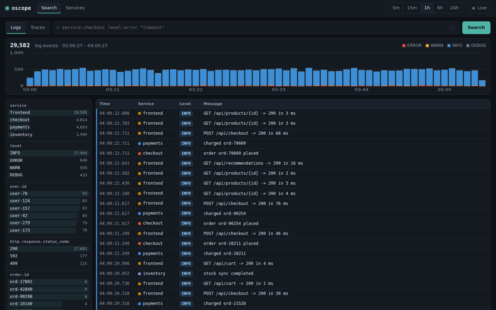 | 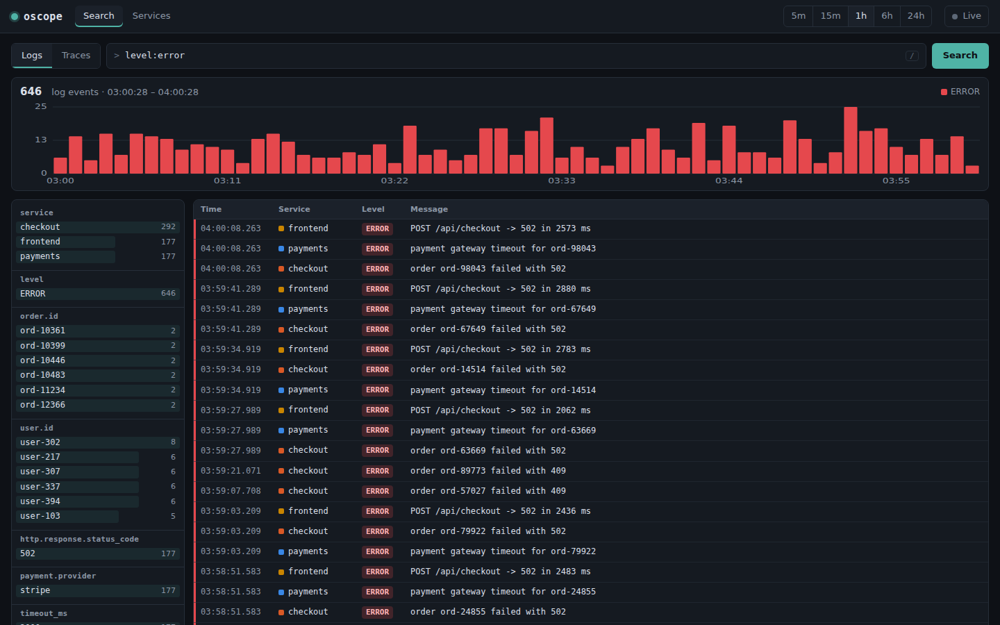 |
| 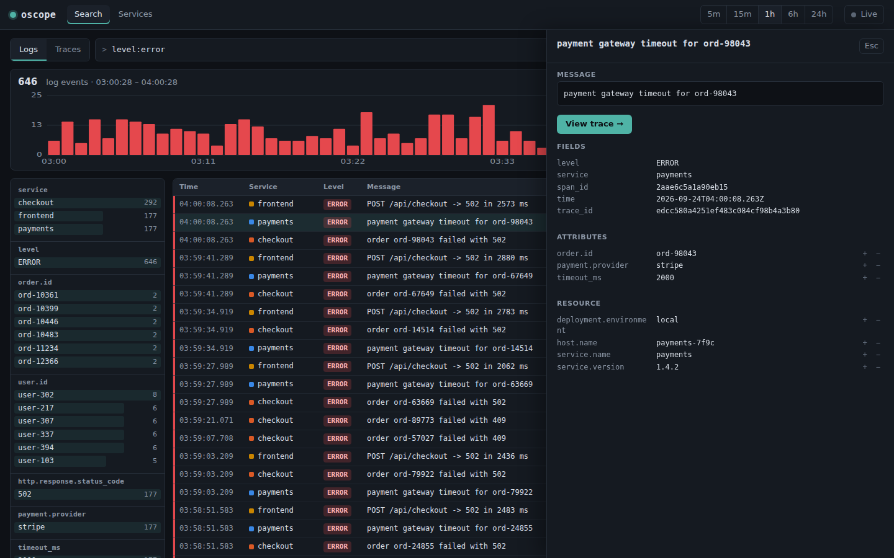 | 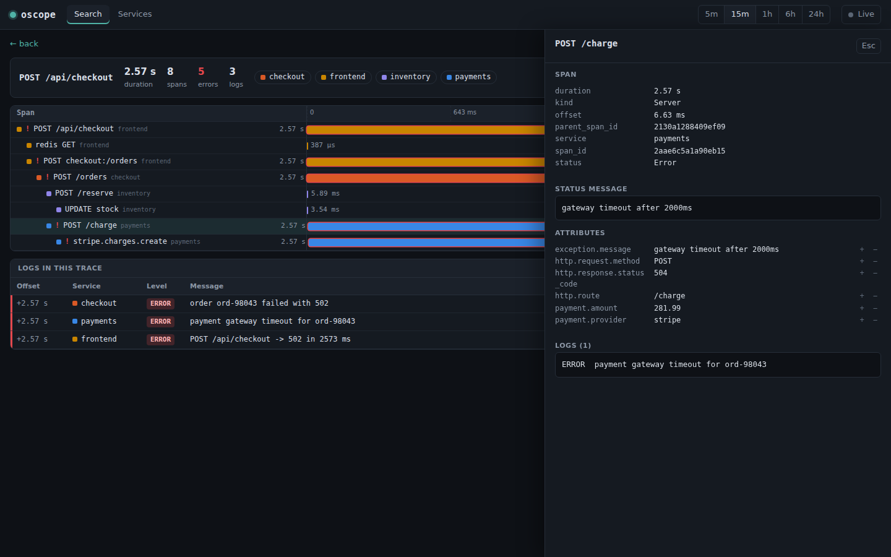 |
| 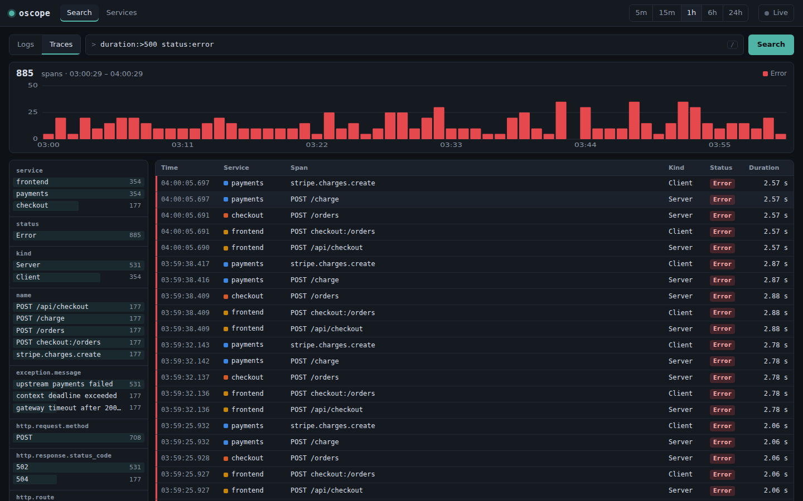 | 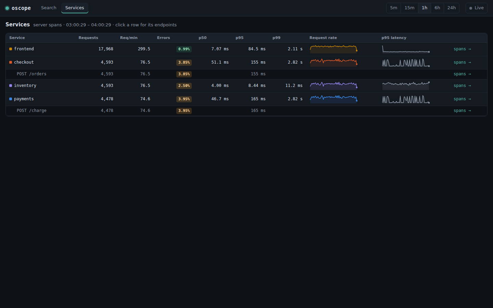 |

### TUI

A VHS recording of the real `oscope-tui` in a real terminal (ttyd + xterm.js):

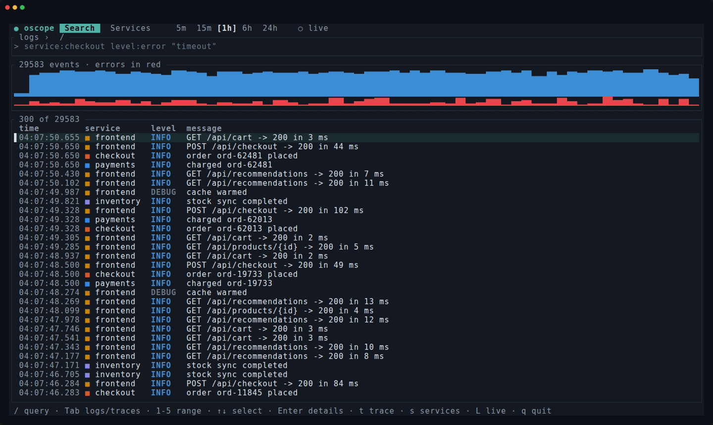

```sh
go install github.com/charmbracelet/vhs@v0.11.0   # not v0.12.0, see below
apt-get install -y ttyd ffmpeg                    # plus a Chromium on PATH as `chromium`
tapes/record.sh                                   # seeds a server, records, checks
```

`tapes/oscope-tui.tape` is the recording. `tapes/oscope-tui-check.tape` replays the same
session with text output (`.ascii`), and `record.sh` asserts that every step appears in it:

- the query;
- the error rows;
- the detail pane;
- the waterfall, with the failing `POST /charge` span and its status message;
- the trace's logs;
- the services table.

So the recording is also an end-to-end test of the actual terminal binary.

Pin VHS v0.11.0. v0.12.0 cancels its context before rendering, so every ffmpeg
call fails before it starts and no GIF is written, while `vhs` still exits 0.
`record.sh` refuses to run with v0.12.0.

There is also a headless path that needs no terminal. `oscope-tui --snapshot out.html --keys "..."`
replays a key script against ratatui's test backend and writes the frame as HTML, and the
Playwright suite asserts on and screenshots those frames:


| | |
|---|---|
| 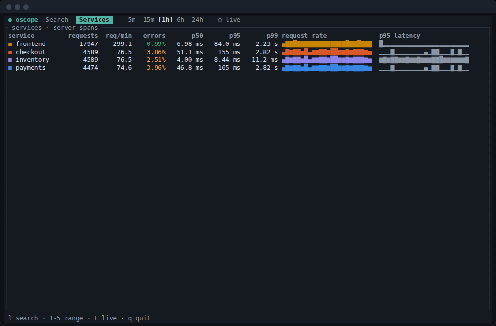 | 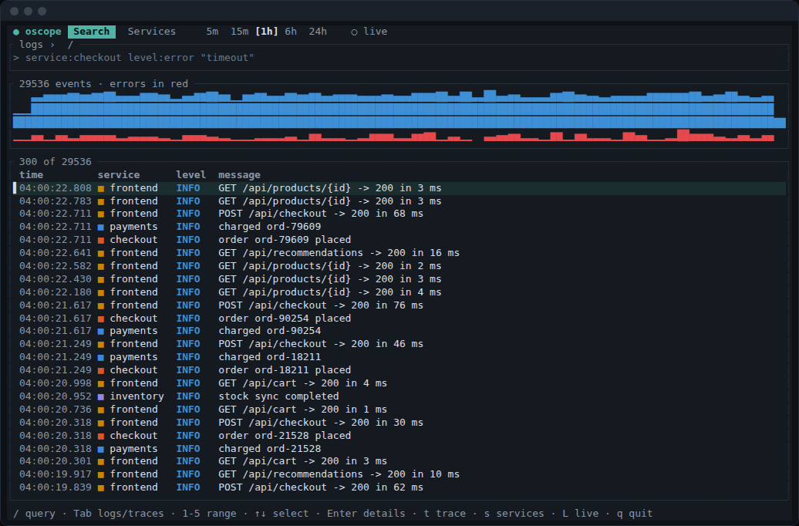 |
| 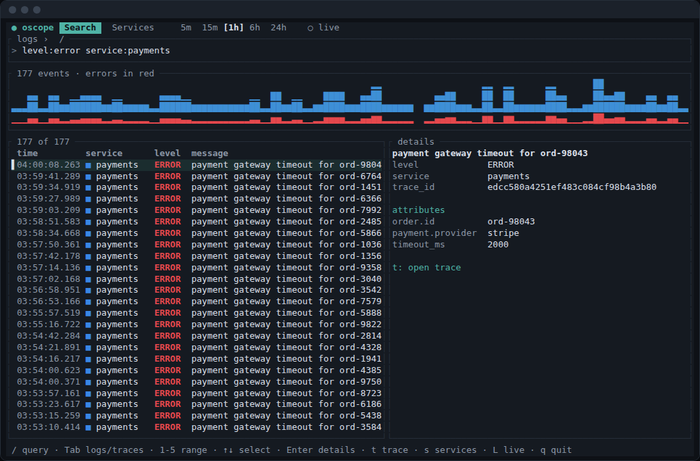 | 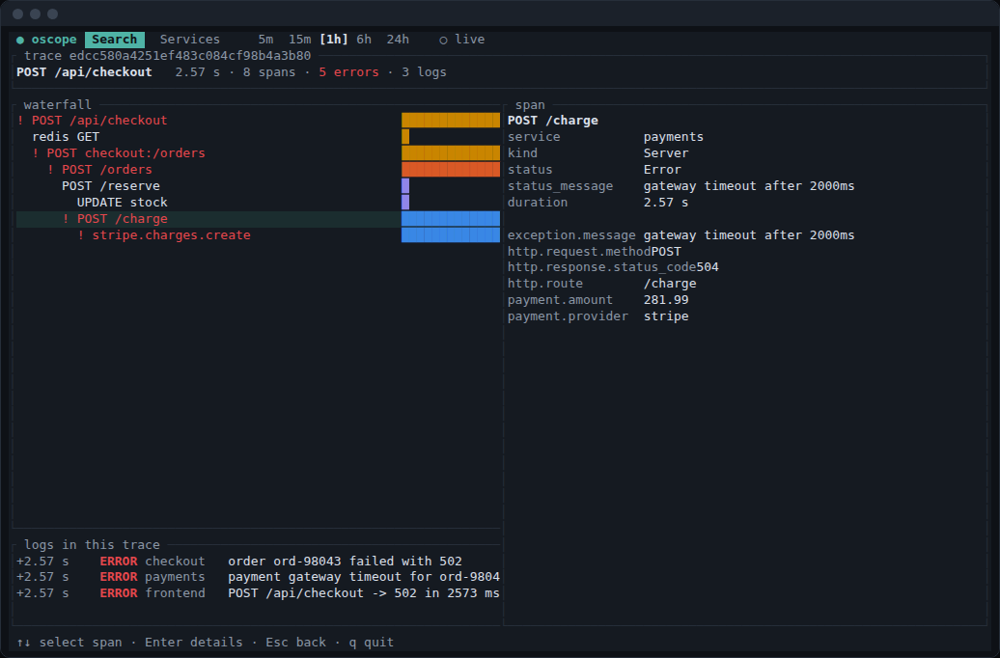 |

The four screenshots above come from snapshot mode. The VHS recording is the real-terminal
counterpart.

## Tests

```sh
cd e2e && npm install
OSCOPE_BIN=../../target/release/oscope OSCOPE_TUI_BIN=../../target/release/oscope-tui npx playwright test --project=e2e
OSCOPE_BIN=... OSCOPE_TUI_BIN=... npm run docs      # screenshots + both GIFs
cargo test -p oscope-server                        # query compiler, TUI rendering
```

Each Playwright run starts a fresh `oscope` with an hour of deterministic seeded traffic.
There are 21 browser tests:

- **Web search:**
  - the histogram, facets and results;
  - the level/service query, free text;
  - facet include and exclude;
  - query error messages, and an injection attempt;
  - histogram zoom, and the detail drawer with attribute filters.
- **Traces:** duration and status filters; an error log leading to the full cross-service
  trace, with nesting, error markers and its 3 logs; unknown and invalid trace IDs.
- **Services:** RED metrics, sparklines, endpoints, and drill-down to spans.
- **Ingest:** an OTLP log appearing in live mode without a reload, OTLP spans forming a
  trace, and protobuf returning 415.
- **TUI:** search, query plus details, trace plus span, services, and a query error.
  `tapes/record.sh` adds 9 checks against a real terminal session.

The GIFs are assembled with `gifenc` and `pngjs`, so ffmpeg isn't needed.

## Known gaps

- OTLP protobuf, gzip and gRPC are not supported yet (415).
- Metrics tables are not shown in the UI.
- There are no saved searches or dashboards yet; the SQLite metadata store is still to come.
- Facet values count only the current window and query. There is no "top values over all
  time" view.
- Queries use one reader connection behind a mutex.
- The UI reads the `*_buf` tables so it sees data within about 250 ms. It runs with
  `optimize_functions_to_subcolumns = 0`, because otherwise the engine turns
  `Attributes['k']` into a map-subcolumn read that Buffer tables can't serve.
